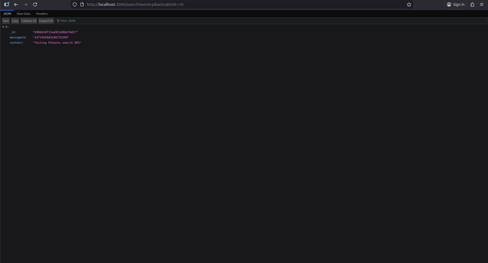
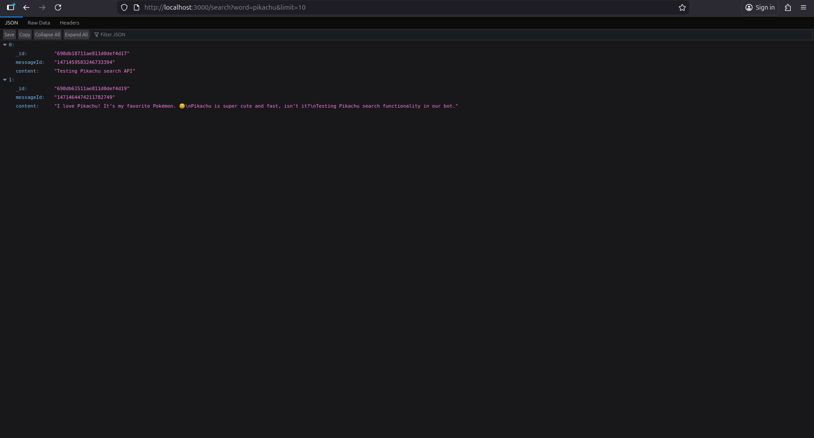
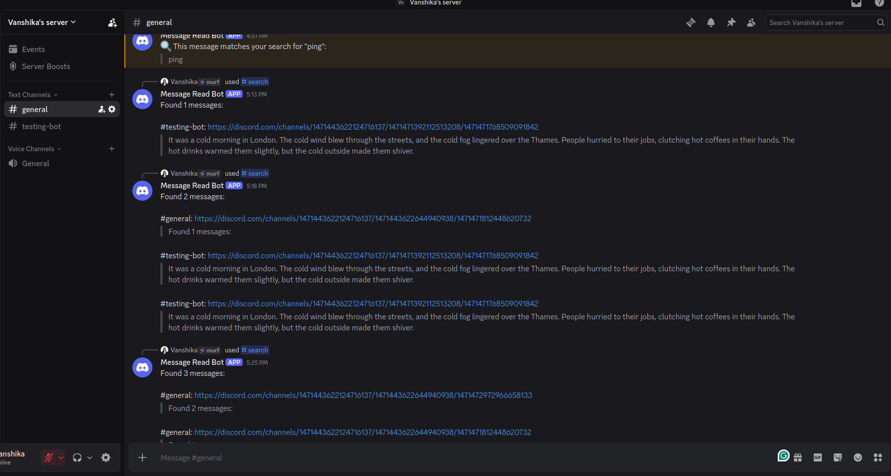
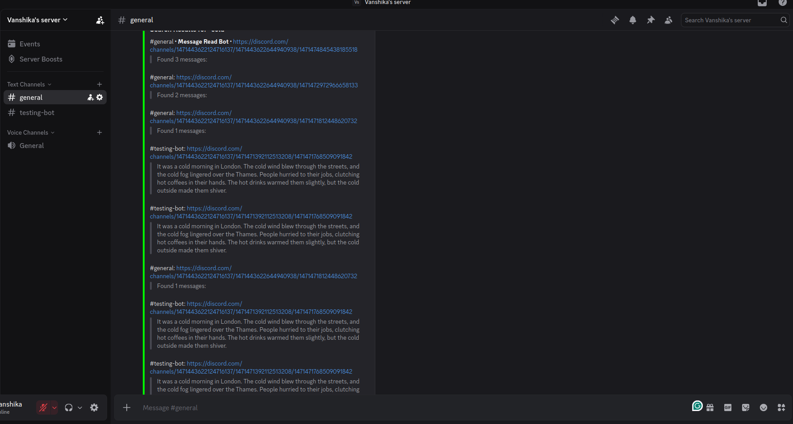

# Discord Bot with MongoDB Integration

A powerful Discord bot with dual operational modes: MongoDB-backed message storage for handling large-scale word queries and a lightweight slash command interface for quick searches.

##  Bot Operation Modes

###  MongoDB Mode 
*Bot stores messages in MongoDB and serves queries via API.*




**Flow:**  
**Bot → Discord Server → MongoDB → API**

---

###  Slash Command Mode 
*Bot responds directly to slash commands in Discord without database storage.*




**Flow:**  
**Bot → Discord Server → Direct Response**


*Visual representation of the bot’s dual modes: MongoDB-backed storage and lightweight slash commands.*


##  Features

- **Dual Mode Operation**
  -  **MongoDB Mode**: Store and search server messages in a database for handling large volumes of data
  -  **Slash Command Mode**: Quick, lightweight word searches using Discord's native slash commands
  
- **Flexible Search**
  - Search for specific words across server messages
  - Configurable result limits
  - Fast and efficient query processing

- **REST API** (MongoDB Mode)
  - Test queries directly via HTTP endpoints
  - Easy integration with other services

---

##  Prerequisites

Before you begin, ensure you have the following installed:

- **Node.js** (v14 or higher)
- **npm** (comes with Node.js)
- **MongoDB** (required for MongoDB mode only)
- **Discord Bot Token** (from [Discord Developer Portal](https://discord.com/developers/applications))

---

##  Installation

### 1. Clone the Repository

```bash
git clone https://github.com/VanshikaSabharwal/Discord-Bot.git
cd Discord-Bot
```

### 2. Set Up Environment Variables

Create a `.env` file from the provided example:

```bash
cp .env.example .env
```

Then edit `.env` and fill in your credentials:

```env
# ===============================
# Discord Bot Configuration
# ===============================

# Your Discord application (bot) ID
DISCORD_APPLICATION_ID=your_discord_application_id_here

# Your Discord bot public key (used for verifying interactions)
DISCORD_PUBLIC_KEY=your_discord_public_key_here

# Your Discord bot token
DISCORD_TOKEN=your_discord_token_here

# Permissions integer for inviting the bot
DISCORD_PERMISSIONS_INTEGER=your_discord_permissions_integer_here

# Generated OAuth2 URL for bot invite
DISCORD_GENERATED_URL=your_discord_generated_url_here

# Your server (guild) ID for slash commands
DISCORD_GUILD_ID=your_discord_guild_id_here

# ===============================
# MongoDB Configuration
# ===============================

# MongoDB connection string
MONGO_URI=your_mongodb_connection_string_here

# ===============================
# Server Configuration
# ===============================

# Port for the API server
PORT=3000

```

### 3. Install Dependencies

```bash
npm install
```

---

##  Usage

The bot can run in two different modes depending on your needs:

### Mode 1: MongoDB Mode 

**Best for**: Large-scale deployments with extensive message history

This mode stores all server messages in MongoDB, allowing you to search through historical data.

#### Start the Server

```bash
npm run withDB
```

This command runs both the API server and the bot:
- `node api/withMongoDB/server.js` - Starts the REST API server
- `node api/withMongoDB/bot.js` - Starts the Discord bot

#### Testing the API

Once running, you can test the search functionality via HTTP:

```bash
# Search for messages containing "cold" with a limit of 10 results
http://localhost:3000/search?word=cold&limit=10
```

**API Endpoint Details:**
- **URL**: `http://localhost:3000/search`
- **Method**: `GET`
- **Query Parameters**:
  - `word` (required): The word to search for
  - `limit` (optional): Maximum number of results to return (default: 10)

**Example Requests:**

```bash
# Basic search
curl "http://localhost:3000/search?word=hello&limit=5"

# Search with default limit
curl "http://localhost:3000/search?word=discord"

# Search for another term
curl "http://localhost:3000/search?word=cold&limit=20"
```

---

### Mode 2: Slash Command Mode ⚡

**Best for**: Lightweight deployments with minimal setup

This mode uses Discord's native slash commands for quick searches without database storage.

#### Start the Bot

```bash
npm run slashCmd
```

#### Using Slash Commands

In your Discord server, use the following command:

```
/search word:<word> limit:<number>
```

**Parameters:**
- `word` (required): The word you want to search for
- `limit` (optional): Number of results to display

**Example:**
```
/search word:cold limit:10
```

---

##  Project Structure

```
.
├── api/
│   ├── withMongoDB/
│   │   ├── server.js      # REST API server
│   │   └── bot.js         # Discord bot with MongoDB integration
│   └── slashCommands/
│       └── bot.js         # Discord bot with slash commands
├── .env.example           # Environment variable template
├── .env                   # Your environment variables (create this)
├── package.json           # Project dependencies and scripts
└── README.md             # This file
```

---

## 🔧 Configuration

### Discord Bot Setup

1. Go to [Discord Developer Portal](https://discord.com/developers/applications)
2. Create a new application
3. Navigate to the "Bot" section and create a bot
4. Copy the bot token and add it to your `.env` file
5. Enable necessary intents:
   -  Message Content Intent (for MongoDB mode)
   -  Server Members Intent
   -  Presence Intent (if needed)
6. Copy your Application ID (Client ID) to `.env`
7. Invite the bot to your server with appropriate permissions

### MongoDB Setup (For MongoDB Mode)

1. Create a MongoDB database (locally or using [MongoDB Atlas](https://www.mongodb.com/cloud/atlas))
2. Copy your connection string
3. Add it to the `MONGODB_URI` field in your `.env` file

---

##  Available Scripts

| Command | Description |
|---------|-------------|
| `npm run withDB` | Run bot with MongoDB integration (API + Bot) |
| `npm run slashCmd` | Run bot with slash commands only |

Make sure these scripts are defined in your `package.json`:

```json
{
  "scripts": {
    "withDB": "node api/withMongoDB/server.js & node api/withMongoDB/bot.js",
    "slashCmd": "node api/slashCommands/bot.js"
  }
}
```

---

##  Troubleshooting

### Common Issues

**Bot doesn't respond to commands**
- Ensure the bot has proper permissions in your server
- Check that all intents are enabled in the Discord Developer Portal
- Verify your `DISCORD_TOKEN` is correct

**MongoDB connection fails**
- Check your `MONGODB_URI` connection string
- Ensure MongoDB is running (if using local instance)
- Verify network access settings (if using MongoDB Atlas)

**Slash commands not showing up**
- Wait a few minutes for Discord to register commands
- Ensure `CLIENT_ID` and `GUILD_ID` are correct in `.env`
- Try re-inviting the bot with the `applications.commands` scope

---

##  Security Notes

- Never commit your `.env` file to version control
- Keep your Discord bot token secret
- Regularly rotate your credentials
- Use environment-specific configurations for production

---

##  License

This project is licensed under the MIT License - see the LICENSE file for details.

---

##  Contributing

Contributions, issues, and feature requests are welcome! Feel free to check the issues page.

---

##  Support

If you have any questions or need help, please:
- Open an issue on GitHub
- Contact the development team
- Check the Discord.js documentation: https://discord.js.org/

---

##  Acknowledgments

- [Discord.js](https://discord.js.org/) - Discord API wrapper
- [MongoDB](https://www.mongodb.com/) - Database solution
- [Express.js](https://expressjs.com/) - Web framework for API

---

##  Invite the Bot

You can invite the bot to your Discord server using the link below:  

[Invite Discord Bot](https://discord.com/oauth2/authorize?client_id=1471440646932926534&permissions=2147559504&integration_type=0&scope=applications.commands+bot)
